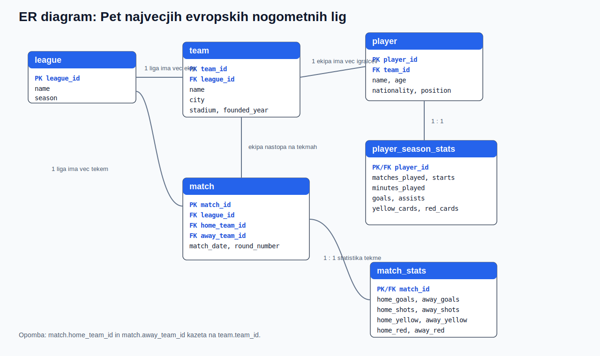

# Pet največjih evropskih nogometnih lig

## Namen projekta
Projekt je spletna aplikacija za pregled sezone 2024/2025 v petih največjih evropskih nogometnih ligah:
Premier League, La Liga, Bundesliga, Serie A in Ligue 1.

Aplikacija je zamišljena kot poenostavljena različica strani, kot sta SofaScore in FlashScore. Uporabnik lahko v brskalniku pregleduje lige, ekipe, igralce, tekme, rezultate, ligaške lestvice in osnovne statistike.

## Funkcionalnosti
- pregled vseh lig,
- pregled ekip v posamezni ligi,
- pregled igralcev v posamezni ekipi,
- pregled vseh tekem,
- filtriranje tekem po ligi, ekipi in krogu,
- iskanje tekem po imenu ekipe ali lige,
- prikaz rezultata in statistike posamezne tekme,
- izračun ligaške lestvice,
- prikaz najboljših strelcev in asistentov,
- iskanje ekip in igralcev.

## Podatki
Podatki so shranjeni v CSV datotekah v mapi `data/`.

Za realne podatke se uporabljata dva javna vira:
- `football-data.co.uk` za razpored tekem, rezultate in statistiko tekem,
- `FBref` za igralce in njihove sezonske statistike.

Uvozni skript je v `scripts/import_real_data.py`. Namenjen je pripravi CSV datotek za sezono 2024/2025.

## Viri podatkov
- Rezultati tekem in statistika tekem: [football-data.co.uk](https://www.football-data.co.uk/data)
- Igralci in sezonska statistika igralcev: [Kaggle - Football players stats 2024/2025](https://www.kaggle.com/datasets/hubertsidorowicz/football-players-stats-2024-2025), ki temelji na podatkih iz [FBref](https://fbref.com/)
- Referenčne strani za preverjanje podatkov: [FBref Big 5 2024/2025](https://fbref.com/en/comps/Big5/2024-2025/2024-2025-Big-5-European-Leagues-Stats)

## Opis baze
Tabela **league** hrani ligo in sezono.

Tabela **team** hrani ekipe, povezane na ligo prek `league_id`.

Tabela **player** hrani igralce, povezane na ekipo prek `team_id`.

Tabela **match** hrani tekme v ligi, domačo ekipo, gostujočo ekipo, datum in krog.

Tabela **match_stats** hrani statistiko tekme. Povezana je s tabelo `match` v razmerju 1 : 1.

Tabela **player_season_stats** hrani realno sezonsko statistiko igralcev, na primer nastope, minute, gole, asistence in kartone.

## Zagon
Najprej je treba namestiti Python in odvisnosti:

```bash
pip install -r requirements.txt
```

Po želji se lahko najprej osvežijo realni podatki:

```bash
python scripts/import_real_data.py
```

Nato se ustvari SQLite baza:

```bash
python main.py
```

Spletna aplikacija se zažene z:

```bash
python app.py
```

V brskalniku se odpre:

```text
http://127.0.0.1:5000/
```

## ER diagram
Posodobljen opis ER modela z relacijami in komentarji je v `docs/er_model.md`.


