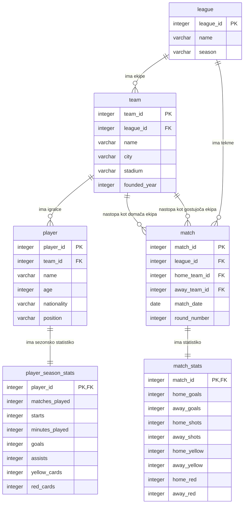

# ER model

Ta dokument opisuje trenutno strukturo baze za projekt petih največjih evropskih nogometnih lig.

## Komentarji relacij

- `league` in `team`: ena liga ima več ekip, vsaka ekipa pripada eni ligi.
- `league` in `match`: ena liga ima več tekem, vsaka tekma pripada eni ligi.
- `team` in `player`: ena ekipa ima več igralcev, vsak igralec je v podatkih vezan na eno ekipo v sezoni.
- `team` in `match`: vsaka tekma ima dve ekipi, domačo in gostujočo.
- `match` in `match_stats`: vsaka tekma ima natanko eno vrstico statistike tekme.
- `player` in `player_season_stats`: vsak igralec ima eno vrstico sezonske statistike.
